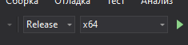

# Цифровая музыкальная студия с уклоном на быструю работу пользователя

Автор: Завьялов Илья ПИ-б-о-191(1).

## Что находится в репозитории

В данном репозитории находятся две папки &mdash; Kiwi и KiwiServer. Внутри Kiwi находится проект Visual Studio для клиента, а внутри KiwiServer для сервера соответственно.

## Как запустить

Данный проект был собран с единственной внешней зависимостью &mdash; SFML. Прежде всего нужно скачать SFML с [официального сайта](https://www.sfml-dev.org/download/sfml/2.5.1/). Отсюда нужно выбрать "Visual C++ 15 (2017) - 64 bit". Вот [прямая ссылка](https://www.sfml-dev.org/files/SFML-2.5.1-windows-vc15-64-bit.zip) на скачивание.

Далее, находящуюся папку внутри архива (SFML-2.5.1) нужно распаковать в любое удобное место.

Теперь, можно открывать .sln файл любого интересующего проекта. До того, как проект можно будет запустить, необходимо будет добавить в свойства проекта путь до распакованного SFML.

Заходим в Проект -> Свойства и там меняем два пункта (Рисунки 1 и 2). 

Необходимо изменить путь в "Дополнительных каталогах включаемых файлов" внутри "C/C++ / Общие" на корректный путь до "SFML-2.5.1\include". Аналогичным образом, меняем путь в "Дополнительных каталогах библиотек" внутри "Компоновщик / Общие" на корректный путь до "SFML-2.5.1\lib".

_Рисунок 1. Первый путь, который нужно заменить_

_Рисунок 2. Второй путь, который нужно заменить_

Делать это нужно для той конфигурации, которую необхомо собрать ("Release" или "Debug"). Платформа обязательно должна быть x64. Это же касается самой сборки (Рисунок 3).

_Рисунок 3. Обязательно собирать на x64 (Release или Debug)_